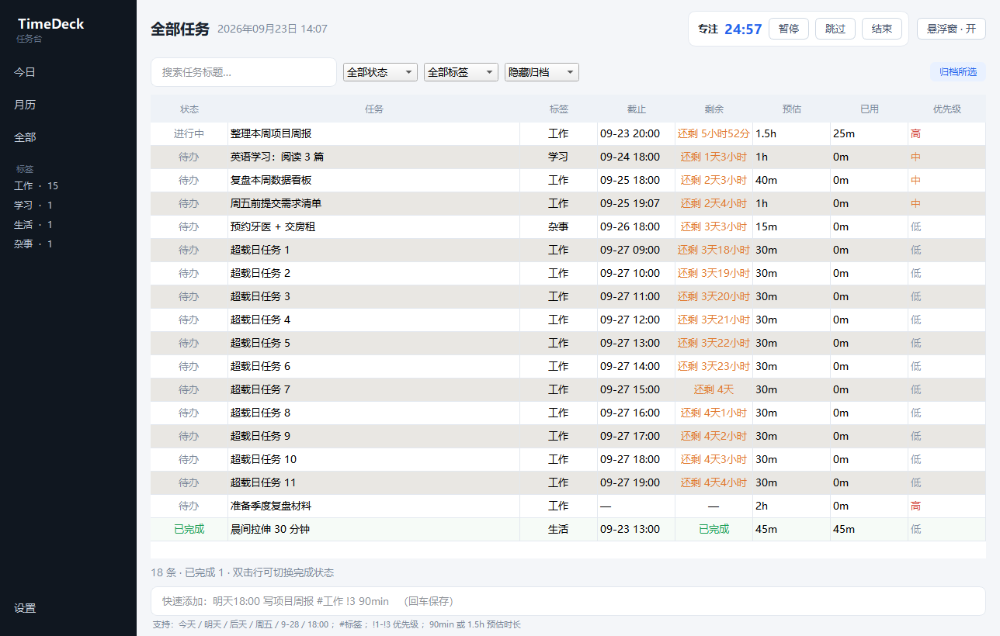

# TimeDeck · 任务台

一个 Windows 桌面待办 + 时间管理小工具：**倒计时专注**、**右下角常驻悬浮窗**、**月历负荷热力图**。
纯本地运行，零配置，数据是一个你能直接打开看的 JSON 文件。

## 功能

- **今日**：按「已逾期 / 今天要做 / 今天已完成」分组，每条任务可一键开始专注。
- **快速添加**：一个输入框看懂自然语言，例如
  `明天18:00 写项目周报 #工作 !3 90min`
  （时间、标题、`#标签`、`!1~3` 优先级、`90min` 预估时长）
- **专注计时器**：时长选在**任务上**（每条任务的「N 分 ▾」按钮，15/25/45/60 或自定义），顶栏的默认值只作为新任务的兜底。
- **悬浮窗**：右下角无边框置顶倒计时，不抢焦点。单击选任务 / 暂停，按住可拖动并吸附屏幕边缘，悬停展开进度条与按钮。
- **月历视图**：日历网格 + 蓝色系负荷热力（当日计划专注分钟数越高，蓝色越深）。
- **系统托盘**：三种后台行为分开——最小化、「关闭」= 隐藏到托盘且**继续计时**、托盘菜单「退出」才真正结束。

## 数据位置

```
%USERPROFILE%\.timedeck\data.json
```

普通文本 JSON，每次写入前滚动保留 `data.json.bak0 ~ bak9` 备份。删掉这个文件等于重置应用。

## 从源码运行

```bat
python -m venv .venv
.venv\Scripts\python -m pip install -r requirements.txt -i https://pypi.tuna.tsinghua.edu.cn/simple
run.bat
```

`run.bat` 优先用 `pythonw`（无黑框）启动，失败时回落到 `python` 打印报错。

## 打包成免安装的便携文件夹

```bat
build_portable.bat
```

产物在仓库同级的 `发布\TimeDeck\`：`TimeDeck.exe` + `_internal\` + `使用说明.txt`。
整个文件夹可以直接拷给别人，对方**不需要装 Python**。

## 界面

| 今日 | 月历负荷 |
| --- | --- |
|  |  |
| **专注进行中** | **全部任务** |
|  |  |

悬浮窗（右下角常驻，左为展开态、右为收起的一行药丸）：

 

| 视图 | 说明 |
| --- | --- |
| 今日 | 分组任务列表 + 快速添加 |
| 月历 | 蓝色热力 + 当日任务详情 |
| 全部 | 搜索、按标签/状态过滤、归档 |
| 设置 | 默认专注时长、托盘与悬浮窗开关、提醒方式 |

## 技术

Python 3 + PySide6（Qt Widgets）。无后端、无网络请求、无数据库。
