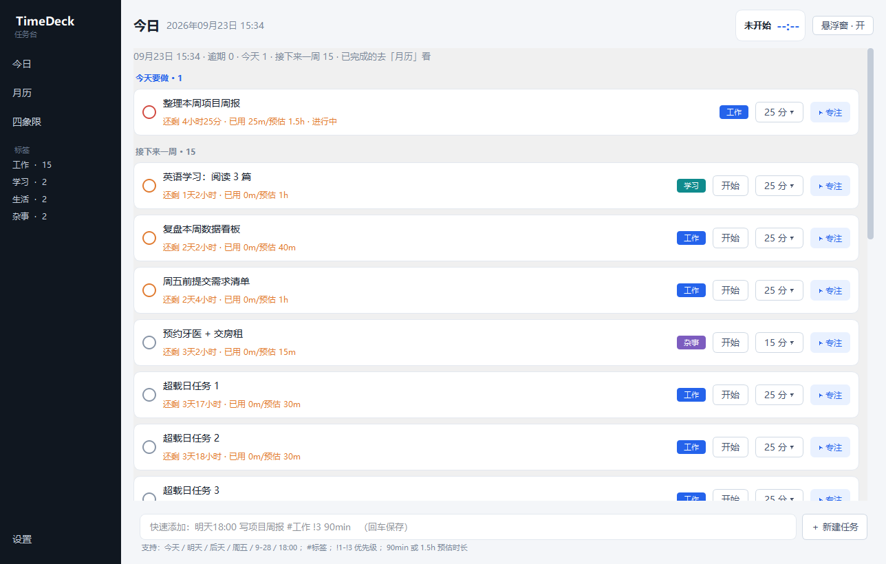
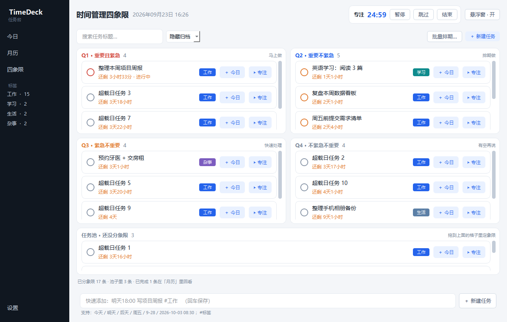
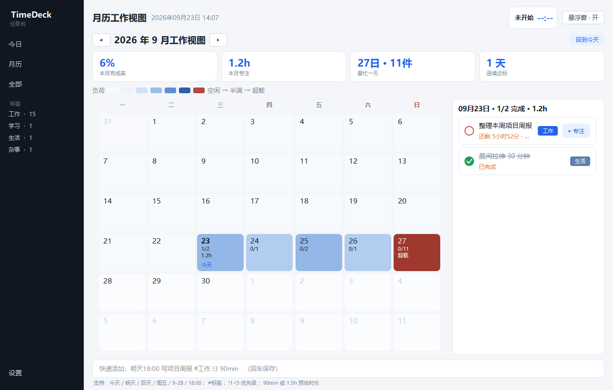
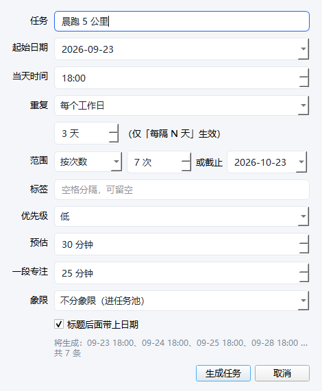
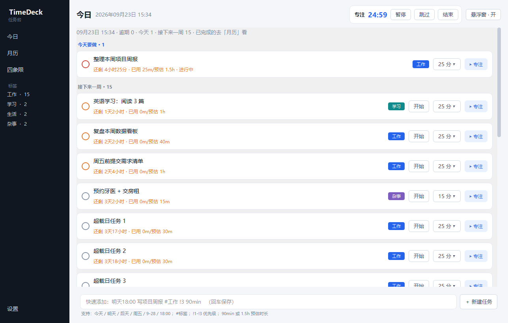
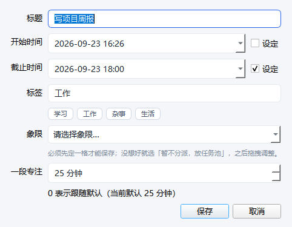

# TimeDeck · 任务台

一个 Windows 桌面待办 + 时间管理小工具：**四象限排任务**、**倒计时专注**、**批量排期**、**右下角常驻悬浮窗**、**月历负荷热力图**。
纯本地运行，零配置，数据是一个你能直接打开看的 JSON 文件。

不想配环境：到 [Releases](https://github.com/Huang-jiale/timedeck/releases/latest) 下载
`TimeDeck-0.1.0-win-x64-portable.zip`（约 44 MB），解压后双击 `TimeDeck\TimeDeck.exe` 即可，
对方电脑**不需要装 Python**。

## 四个视图

- **今日**：只放还没做完的事，按「已逾期 / 今天要做 / 接下来一周 / 待安排」分组，每条任务可一键开始专注。做完的就从今日消失，去「月历」回看。
- **四象限**：重要 × 紧急的时间管理四象限。任务预先写在这里，需要时点一下「＋ 今日」就排到今天就做。
- **月历**：只读的记录视图。日历网格 + 蓝色系负荷热力（当日计划专注分钟数越高，蓝色越深），点某天看那天做完了什么。
- **设置**：默认专注时长、休息时长、超载阈值、悬浮窗与托盘开关、提醒方式。

## 用法要点

- **快速添加**：顶部输入框看懂自然语言，例如
  `明天18:00 写项目周报 #工作 !3 90min`
  （时间、标题、`#标签`、`!1~3` 优先级、`90min` 预估时长）
- **拖拽定象限**：想用哪条轴判断紧急程度由你自己定——把任务卡拖进某个象限即可，拖回上方「任务池」就是取消分类。
- **单条编辑**：双击任意任务（未开始 / 进行中 / 已完成都能改）打开表单，开始时间、截止时间、标签、优先级、预估总时长、一段专注时长、象限、状态全部可选。
- **批量排期**：四象限页的「批量排期…」按重复规则一次生成一整段时间的任务——每天 / 每隔 N 天 / 每个工作日 / 每周固定几天，配合「生成 N 条」或「直到某日」，右侧实时预览落在哪几天。
- **专注计时器**：时长选在**任务上**（每条任务的「N 分 ▾」按钮，15/25/45/60 或自定义），设置里的默认值只作为新任务的兜底。
- **悬浮窗**：右下角无边框置顶倒计时，不抢焦点。按住可拖到屏幕任意位置，四条边都能贴合吸附，露出约 4px 便于再抓回来；悬停展开进度条与按钮。
- **系统托盘**：三种后台行为分开——最小化、「关闭」= 隐藏到托盘且**继续计时**、托盘菜单「退出」才真正结束。

## 数据位置

```
%USERPROFILE%\.timedeck\data.json
```

普通文本 JSON，每次写入前滚动保留 `data.json.bak0 ~ bak9` 备份。删掉这个文件等于重置应用。

## 从源码运行

```bat
python -m venv .venv
.venv\Scripts\python -m pip install -r requirements.txt -i https://pypi.tuna.tsinghua.edu.cn/simple
run.bat
```

`run.bat` 优先用 `pythonw`（无黑框）启动，失败时回落到 `python` 打印报错。

## 打包成免安装的便携文件夹

```bat
build_portable.bat
```

它调用同目录的 `build_portable.py` 跑 PyInstaller（必须用 Python 拉起，`.bat` 里换行续行容易踩坑）。
产物在仓库同级的 `发布\TimeDeck\`：`TimeDeck.exe` + `_internal\` + `使用说明.txt`。
整个文件夹可以直接拷给别人，对方**不需要装 Python**。

## 界面

| 今日 | 四象限 |
| --- | --- |
|  |  |
| **月历负荷（只读回看）** | **批量排期** |
|  |  |
| **专注进行中** | **任务编辑表单** |
|  |  |

悬浮窗（右下角常驻，左为展开态、右为收起的一行药丸）：

 

## 技术

Python 3 + PySide6（Qt Widgets）。无后端、无网络请求、无数据库。
